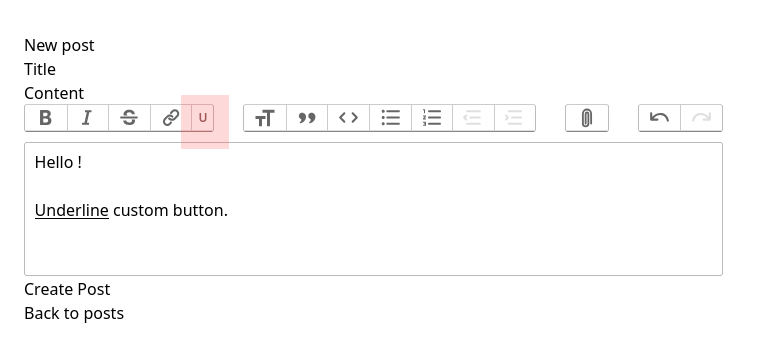

# 🎨 Enhancing the Trix Rich Text Editor in Ruby on Rails 8: A Custom Touch for a Better Experience!

### [Open complete article](https://rubystacknews.com/2025/03/13/%f0%9f%8e%a8-enhancing-the-trix-rich-text-editor-in-ruby-on-rails-8-a-custom-touch-for-a-better-experience/)


## Start Project:

```
git clone https://github.com/ggerman/ruby_stack_news_enhancing_the_trix_rich_text.git
cd ruby_stack_news_enhancing_the_trix_rich_text
./bin/start.sh up
```

## Open in Browser:

http://0.0.0.0:3000/posts/new



